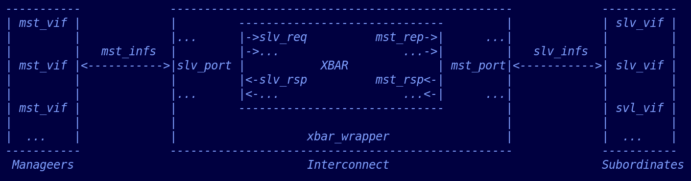
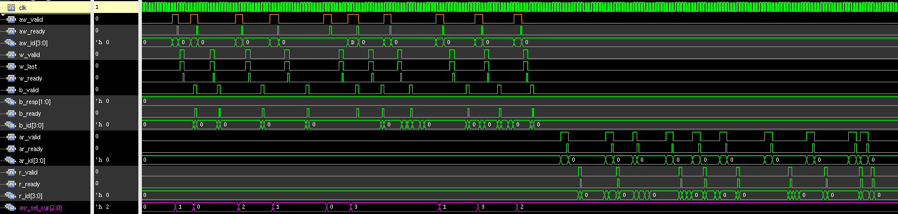
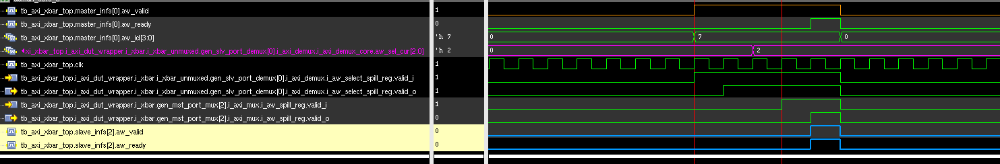
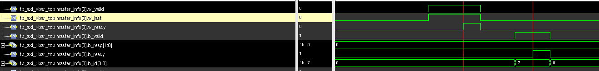
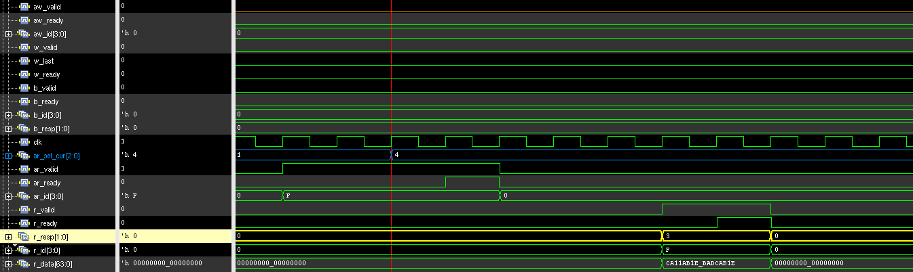
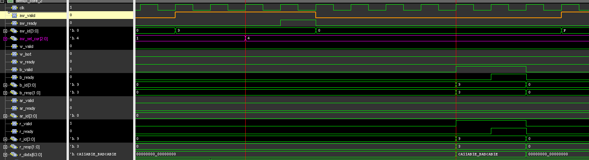
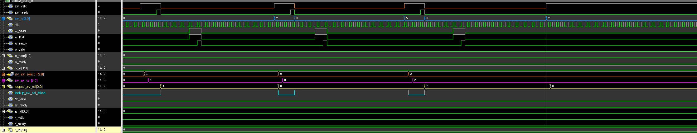
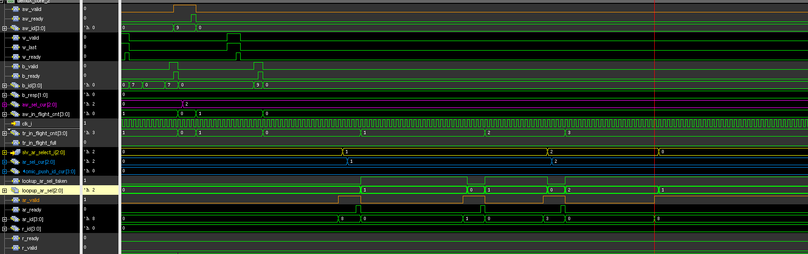

#  1. testbench architecture 

Verification components
Managers：      3 
Subordinate：   4 

# 2. Key Scenarios (examles)
## 2.1 Non-atomic transaction 
Manager initiates `aw` followed by `ar`
The waveform of Manager-0 

For an `aw`, The `valid` arrives to the Subordinate after 4 cycles. 
The spill register of Demuxiplexer and Multiplexer each will delay one cycle. 
Therefore, The crossbar will delay 2 cycles to route the `aw`. 

There is no spill register for `w` and `b`, the crossbar will delay 2 cycles to route the `w` and 1 cycle to route the `b`.

For an `ar`, The `valid` arrives to the Subordinate after 4 cycles. 
The spill register of Demuxiplexer and Multiplexer,each will delay one cycle. 
Therefore, The crossbar will delay 2 cycles to route the `ar`. 
The crossbar will delay 1 cycle to route the `r`.
## 2.2 Atomic transaction 
Manager initiates `AtomicStore` followed by `AtomicLoad` .
The Manager-0 waveform: 

The crossbar's delay is the same with non-atomic `aw`. 
## 2.3 Error handle 
Randomize `aw`,`ar`, `AtomicStore`, `AtomicLoad` with out-of-bounds address. 
### (1) non-atomic `aw` 

For a non-atomic `aw`, since there is a spill register in Demuxiplexer, the crossbar's default Subordinate will still delay 2 cycles to handle the `aw`. 
The crossbar's default Subordinate will delay 2 cycles to receive the `w` data, and after the `w`, delay 3 cycles to return `b` response with `SLVERR` as configured. 
### (2) `AtomicStore`

For an `AtomicStore`, since there is a spill register in Demuxiplexer, the crossbar's default Subordinate will still delay 2 cycles to handle the `AtomicStore`, and after completing the `AtomicStore`, delay 4 cycles to return `b` response with `SLVERR` as configured. 
### (3) `ar`

For an `ar`, since there is a spill register in Demuxiplexer, the crossbar's default Subordinate will still delay 2 cycles to handle the `ar`, and after completing the `ar`, delay 3 cycle to return `r` with specific data pattern and `SLVERR` as configured. 
### (4) `AtomicLoad`

For an `AtomicLoad`, 
since there is a spill register in Demuxiplexer, the crossbar's default Subordinate will still delay 2 cycles to handle the `AtomicLoad`, and after completing the `AtomicLoad`, delay 4 cycle to return `b`with `SLVERR` and `r` with specific data pattern and `SLVERR`.
## 2.4 The ordering 
### (1) `aw` ordering 

There is an in-flight `aw` with ID of `'h7` trageting to the Subordinate `0`, when another `aw` with ID of `'h7` targeting to the Subordinate `2` arrives the Demultiplexer, the Demultiplexer stalls this `aw`. 

### (2) `ar` ordering 

There is an in-flight `ar` with ID of `'h8` trageting to the Subordinate `1`, when another `ar` with ID of `'h8` targeting to the Subordinate `0` arrives the Demultiplexer, the Demultiplexer stalls this `ar`. 
### (3) The Maxmum in-flight Transaction of the Manager 

When there are already Maxmum in-flight Transactions waiting to be responsed, the Demultiplexer will stall the following requests. 

## 2.5 Requests initiated at the same time
The `aw` requests from 3 Managers to the same Subordinate occurs in the Multiplexer at the same time. 

For the initial arbitration, there are 3 cocurrent requests, the arbitor grants the request in the order of `0->1->2`, so priority goes to `0`. After this sequence, the request `0` occurs, the priority is exactly for `0`, then request `0` is granted, the priority goes to `1`. Then the request `2` occurs, since the priority `1` does not be requested, the arbitor grants the request `2`, the priority goes to `0`. 
