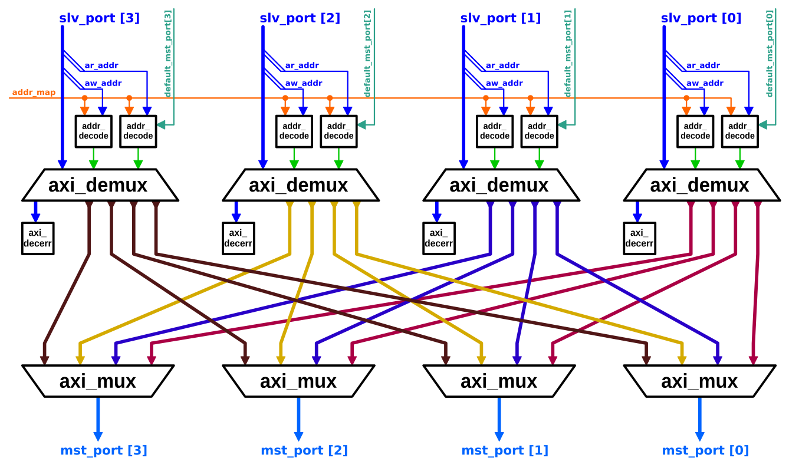
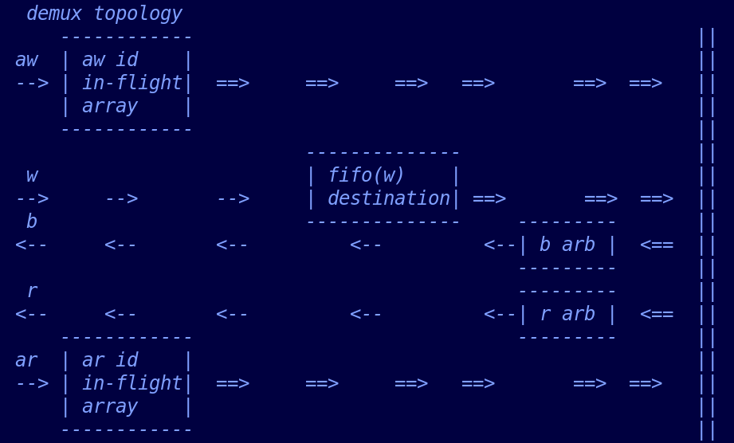
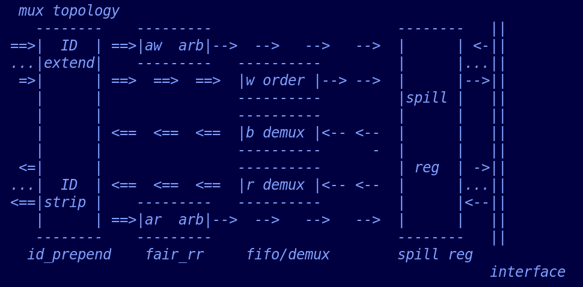

# 1. Functional Description 
The AXI crossbar implements a sophisticated switching matrix that provides full connectivity between multiple slave ports (master connections) and multiple master ports (slave connections). Unlike simple multiplexers, the crossbar performs address decoding to route transactions to appropriate destinations based on a configurable address map and deals with the scenario that the Subordinate does not support Atomic transactions. The design supports the complete AXI4 specification plus atomic operations (ATOPs) from AXI5, making it suitable for cache-coherent and high-performance computing applications.
# 2. Architecture Overview 

#### 1. Slave port: Address Decoding, Demultiplexing and Default Slave handling error situations (`axi_xbar_unmuxed` instances)
1. **Address Decoders**: Per-slave-port address decoding and Subordinate ATOP configuration using configurable address maps
2. **Request Demultiplexing**: Route AW/AR/W transactions to appropriate master port lanes
3. **Response Arbitration**: Non-QoS system, arbitrate responses from the downstream Subordinate by Fair Rounder-Robin Arbiter. 
4. **Error Handling**: Dedicated default slave for decode failures, invalid connections and atomic operations where the Subordinate does not support ATOPs. 
5. ~~*Pipeline Stages**: Configurable pipeline registers for timing optimization~~

#### 2. Master port: Request Arbitration and Response Multiplexing (`axi_mux` instances)
1. **ID Extension**: Prepend slave port index to transaction IDs for response routing and strip extended ID for master port. 
2. **Request Arbitration**: Round-robin arbitration for AW/ AR channel requests.
3. **Transaction Tracking**: FIFO-based write transaction correlation
4. **Flow Control**: Sophisticated back-pressure management based on VALID/READY handshake signals. 

# 3. Key Architectural Features

- **Fully-Connected Topology**: Each slave port can access any master port
- **Configurable Connectivity Matrix**: Disable unused connections for area optimization
- **Address-Based Routing**: Flexible address map with priority-based rule matching
- ~~**Default Master Ports**: Configurable default routing for unmapped addresses~~
- **Atomic Operation Support**: Full AXI5 ATOP support with proper ordering
- ~~**Advanced Pipeline Control**: Multi-level pipeline configuration for timing closure~~
- **Decode Error Handling**: Dedicated error responses for protocol violations
  
# 4. Design implementation 
## 4.1 Demultiplexer 

There are four requirements for AXI ordering model: 
- 1. Transaction responses with the same ID are returned in the same order as the requests were issued.
- 2. The interconnect must ensure that the read data from a sequence of transactions with the same ARID value targeting different Subordinates is received by the Manager in the order that it issued the addresses.
- 3. An interconnect that combines write transactions from different Managers must ensure that it forwards the write data in address order.
- 4. Atomic transactions must not use AXI ID values that are used by Non-atomic transactions that are outstanding at the same time. This rule applies to transactions on either the AR or AW channel. This rule ensures that there are no ordering constraints between Atomic transactions and Non-atomic transactions.

To maintain the ordering model, there are two **ID in-flight array**(one for w transaction, the other for r transaction) and one fifo to store the destination the `w` will go to. Each array stores the ID and destination information, therefore when an `ar` with the same ID with in-flight one but target to two different destination, the demultiplexer will stall the latter `ar` to avoid the potential `r` response reordering requirement, in other words, the later `ar` maybe response (`r`) earlier than the former one. As for `aw` ordering, this mechanism reduce the complexity arbitration of `b`, due to the latter `aw` may be response earlier than the former. 

The requirement of forwarding the write data from different Managers in address order is guaranteed by Multiplexer in section 4.3. 

The sum of the number of in-flight `aw` and `ar` constrains the Maximum in-flight transaction for the Manager. 

There are two **Fair Round-Robin Arbiter** (one for `b`, one for `r`), due to the ID in-flight array and Multiplexer guarantee the ordering requirement, the arbiter for responses can be implemented in fair round-robin style (responses are served in a rotating order). 

The ID in-flight arraies are also used by atomic transaction ordering model. When an atomic `aw` arrives, the demultipler will look up if there are any in-flight w/r transaction using the same ID, if there is, the demultiplexer will store this `aw` until all in-flight transactions using the same ID are completed. 

## 4.2 Default Slave 
There are two requirements for error situation: 
- 1. When the interconnect cannot decode an address of `AxADDR`, it will response the `DECERR` and  complete all data transfers.  

- 2. If the endpoint Subordinate does not support atomic operations, the interconnect will give an error response for the atomic transaction and consume the write data and send the correct number of read data beats by the default Subordinate implemented in the interconnect.

The AXI4+ATOPs crossbar implements the defult Subordinate as the specification recommendation. 
- For write transaction, the default subordinate will consume the `W`, and response `DECERR` or `SLVERR` as configured.
- For read transaction, the default subordinate will generate a specific data pattern of the required burst_length defined by `ARLEN` as `r` with `DECERR` or `SLVERR` as configured.
- For atomic transaction, if it is `AtomicStore`, the default subordinate will response `b` with `DECERR` or `SLVERR` as configured; if it is `AtomicLoad` or `AtomicSwap` or `AtomicCompare`, the default subordinate will response `b` `DECERR` or `SLVERR` as configured, and `r` whose length is defined by `ARLEN`, except for the `AtomicCompare` operation, if `AWLEN` indicates a burst length greater than 1, then the number of
read data transfers is half that specified by `AWLEN`.
## 4.3 Multiplexer 

The Multiplexer extends the ID for `aw` and `ar` to the Subordinate, to determine the destination of their responses. When the responses arrives, it will also strip these extended ID bits for the upstream Demultiplexer. 

There are two **Fair Round-Robin Arbiter**s (one for `aw`, one for `ar`) to handle the requests from different Managers in the same time. 

The Multiplexer uses a fifo(w) to forward the write data from different Managers in address order. The fifo stores the extended `AWID` (Manager index) granted by the the aw arbiter, so it will forward the `w` as the order constrained by the fifo.

The Multiplexer duplicates the `b` except the `valid` and duplicates the `r` except the `valid` for Demultiplexer. 